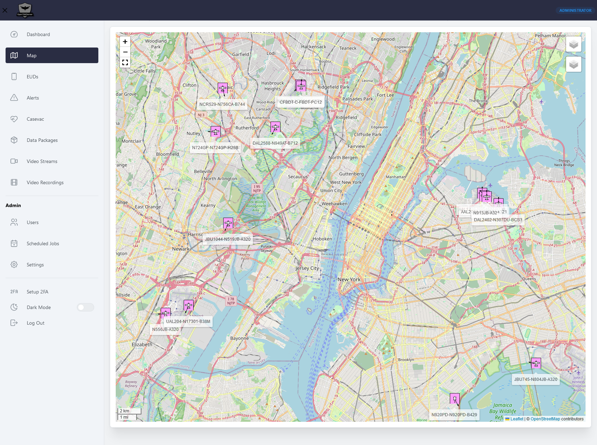

# ADS-B

***

OpenTAKServer can pull live ADS-B data from the free [Airplanes.live](https://airplanes.live/) [API](https://airplanes.live/api-guide/). Aircraft will show on both
your EUD's map and OpenTAKServer's map with 2525c icons.

## Airplanes.live API Limits

***

Airplanes.live limits their API to at most one request per second and a radius of 250nm.

## Setting Location

***

You can change the location and radius to query in your `config.yml` file. The options are:

- `OTS_AIRPLANES_LIVE_LAT`: Latitude
- `OTS_AIRPLANES_LIVE_LON`: Longitude
- `OTS_AIRPLANES_LIVE_RADIUS`: In nautical miles and cannot be greater than 250

## Setting Query Frequency

***

While logged into the OTS web UI as an administrator, click on `Scheduled Jobs` in the navigation bar. Find the
`Airplanes.live job` in the table and click the `Edit` button. Enter the desired amount of minutes and seconds to
query the API and click the `Save` button.

Click on the `Activate` switch to enable the job.

## Run a Query Immediately

***

You can query the API while the scheduled job is deactivated, or before it is due to be run. While logged into the web UI
as an administrator, click on `Scheduled Jobs`, then click the `Run Now` button.

## Screenshot

***

