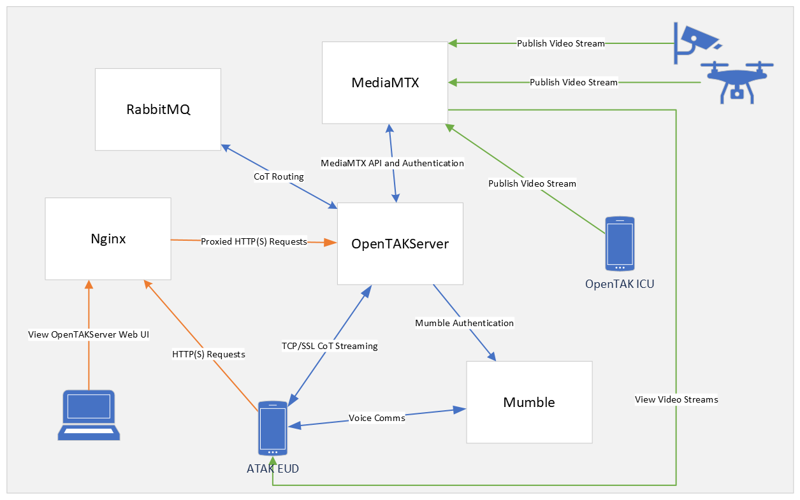

# Architecture

As of version 1.5.0, OpenTAKServer is split into three parts, the API, the EUD handler, and the CoT parser. Each part runs as its
own separate process. This solves a bottleneck issue caused by the [Python Global Interpreter Lock (GIL)](https://wiki.python.org/moin/GlobalInterpreterLock).

## EUD Handler

The EUD Handler listens on a TCP port, specified by `OTS_TCP_STREAMING_PORT` or `OTS_SSL_STREAMING_PORT`, and is the main point of
interaction between OpenTAKServer and EUDs. When an EUD sends a CoT message, `eud_handler` will publish it to RabbitMQ for `cot_parser`
to parse. Likewise, when another EUD publishes a CoT message, `eud_handler` consume the message and send it to the EUD.

## CoT Parser

The CoT Parser connects to the RabbitMQ server and parses CoT messages sent by EUDs. There can be multiple instances of CoT parsers
running at once. This allows you to take full advantage of your CPU cores if you have a high number of incoming CoT messages per second.
If there are too many incoming CoT messages for the server to handle, additional servers can run more instances of `cot_parser`
for extra processing power.

## Ports

Below is a table of all default ports used by OpenTAKServer. For unencrypted TCP communications, ports 80, 8080, and 8088 are required.
For SSL encrypted communications, ports 443, 8443, 8446, and 8089 are required. In either case, the rest of the ports are optional.

| Port  | Component     | Protocol | Interface            | Description                                                             |
|-------|---------------|----------|----------------------|-------------------------------------------------------------------------|
| 80    | Nginx         | TCP      | All                  | Web UI and proxy for HTTP API requests to OpenTAKServer port 8081       |
| 443   | Nginx         | TCP      | All                  | Web UI and proxy for HTTPS requests to OpenTAKServer port 8081          |
| 1883  | RabbitMQ      | TCP      | All                  | Unencrypted MQTT port used for Meshtastic                               |
| 1935  | MediaMTX      | TCP      | All                  | Publish and view RTMP video streams                                     |
| 1936  | MediaMTX      | TCP      | All                  | Publish and view RTMPS video streams                                    |
| 5672  | RabbitMQ      | TCP      | All                  | For AMPQ clients, should be blocked from external access in most cases  |
| 6502  | Mumble Server | TCP      | Loopback (127.0.0.1) | Mumble's ICE server, used by OpenTAKServer to provide authentication    |
| 8000  | MediaMTX      | UDP      | All                  | Publish and view RTP video streams                                      |
| 8001  | MediaMTX      | UDP      | All                  | Publish and view RTCP video streams                                     |
| 8080  | Nginx         | TCP      | All                  | Web UI and proxy for HTTP API requests to OpenTAKServer port 8081       |
| 8081  | OpenTAKServer | TCP      | Loopback (127.0.0.1) | OTS listens on this port on the loopback interface for HTTP(S) requests |
| 8189  | MediaMTX      | UDP      | All                  | WebRTC                                                                  |
| 8088  | OpenTAKServer | TCP      | All                  | TCP CoT streaming port                                                  |
| 8089  | OpenTAKServer | TCP      | All                  | SSL CoT streaming port                                                  |
| 8443  | Nginx         | TCP      | All                  | Web UI and proxy for HTTPS API requests to OpenTAKServer port 8081      |
| 8446  | Nginx         | TCP      | All                  | Web UI and proxy for certificate enrollment to OpenTAKServer port 8081  |
| 8322  | MediaMTX      | TCP      | All                  | Publish and view RTSP(S) video streams                                  |
| 8554  | MediaMTX      | TCP/UDP  | All                  | Publish and view RTSP video streams                                     |
| 8883  | RabbitMQ      | TCP      | All                  | Encrypted MQTT port used for Meshtastic                                 |
| 8888  | MediaMTX      | TCP      | All                  | View HLS video streams                                                  |
| 8889  | MediaMTX      | TCP      | All                  | Publish and view WebRTC streams                                         |
| 8890  | MediaMTX      | UDP      | All                  | Publish and view SRT streams                                            |
| 9997  | MediaMTX      | TCP      | Loopback (127.0.0.1) | MediaMTX's API                                                          |
| 25672 | RabbitMQ      | TCP      | All                  | RabbitMQ Federation, external access should be blocked in most cases    |
| 64738 | Mumble Server | TCP/UDP  | All                  | Mumble server voice streams                                             |

## Diagram

Here is an attempt at a diagram to help visualize the components used in OpenTAKServer and how they interact.

