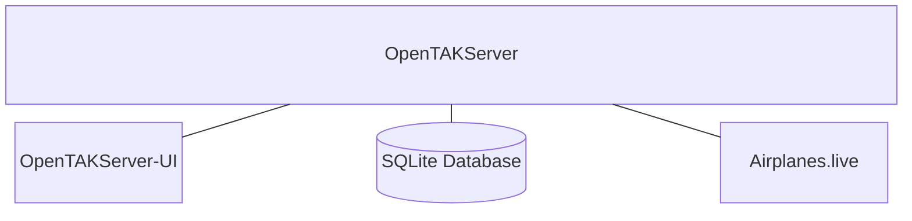
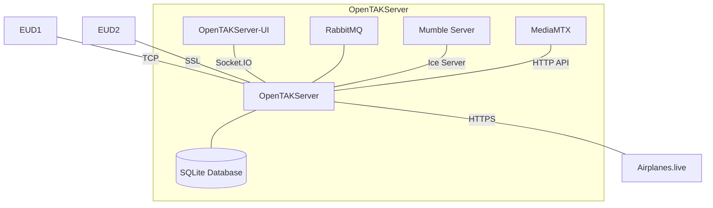

# Architecture

***

```mermaid
block-beta
  columns 1
      OTS["OpenTAKServer"]
      block:A
        UI["OpenTAKServer-UI"] space DB[("SQLite Database")] space ADSB["Airplanes.live"]
      end

    OTS---DB
    UI---OTS
    OTS---ADSB
    style A fill:#00000000,stroke-width:0px
```

```mermaid
graph TD
    OTS["OpenTAKServer"]
    UI["OpenTAKServer-UI"]
    RMQ["RabbitMQ"]
    DB[("SQLite Database")]
    Mumble["Mumble Server"]
    MTX["MediaMTX"]
    ADSB["Airplanes.live"]
    EUD1["EUD1"]
    EUD2["EUD2"]
    
    OTS---|HTTPS|ADSB
    EUD1---|TCP|OTS
    EUD2---|SSL|OTS
    
    subgraph OpenTAKServer
        OTS---DB
        UI---|Socket.IO|OTS
        RMQ---OTS
        Mumble---|Ice Server|OTS
        MTX---|HTTP API|OTS
    end
```