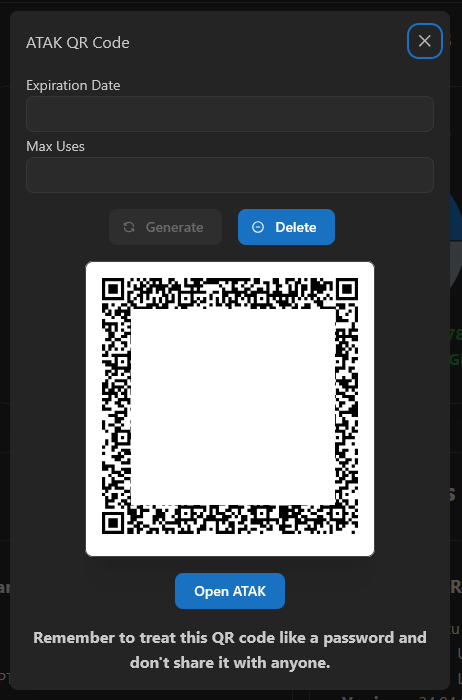
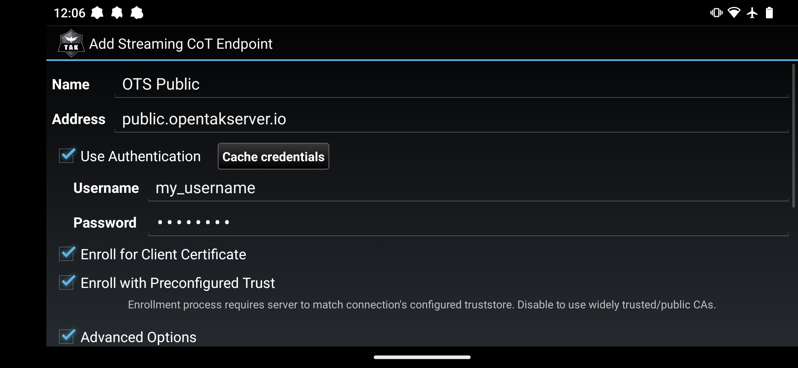
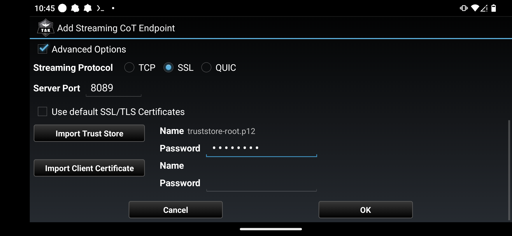

# Certificate Enrollment

OpenTAKServer supports client certificate enrollment which defaults to port `8446`.

## Authentication

Certificate enrollment requires authentication. You will need to register an account on your OpenTAKServer or
have an administrator make an account for you.

## Prerequisites

The default port for certificate enrollment is `8446`. This port will use one of two types of certificates, self-signed 
or Let's Encrypt. The default is to use self-signed certificates. If your server uses self-signed certificates, you will need
a copy of your server's truststore certificate for auto-enrollment. You can download a copy at 
`https://your_server_address/api/truststore` or by logging into the web UI and clicking the `Download Truststore` button.

## iTAK QR Code

In order to use a QR code for iTAK enrollment, your server must be configured with a signed certificate from Let's Encrypt
or a similar trusted certificate authority.

## ATAK QR Code

Starting in version 1.5.0, OpenTAKServer supports QR code generation for ATAK certificate registration. This feature requires that your
server has a domain name with a trusted cert from Let's Encrypt or a similar trusted certificate authority. When generating
a QR code, you can optionally specify an expiration date and a maximum number of uses. If either or both are specified,
the QR code will no longer work after the expiration date or the maximum number of uses (whichever comes first).
The QR code can also be deleted. If it's scanned after being deleted, certificate registration will fail.

Each user can only have one active QR code at a time but the code can be deleted and regenerated at any time. The QR code is
unique to the user that generated it and should be treated like a password in most cases. However, it is possible to generate a single
QR code and let multiple users scan it.

To scan the QR code, use your EUD's camera app or any QR code scanning app. Once scanned, opening the link will automatically
open ATAK and start the certificate registration process. This method does not require the user to uncheck the Preconfigured Trust
option.

Alternatively, if you are logged into the web UI on your EUD you can tap the `Open ATAK` button instead of scanning the QR
code to start the certificate registration process.

## Instructions

1. On the main ATAK screen, tap the hamburger icon in the top right corner and tap `Settings`
2. Tap on `Network Preferences`
3. Tap on `TAK Servers`
4. Tap the three vertical dots button in the top right corner and tap `Add`
5. Fill out your server's name and address
6. Check the `Use Authentication` checkbox and enter your OpenTAKServer username and password
7. Check the `Enroll for Client Certificate` checkbox
8. Make sure Streaming Protocol is set to `SSL`
9. The default server port is `8089` unless OpenTAKServer has been configured to use a different port. Ask your server's admin if you are unsure
10. Use default SSL/TLS Certificates
    1. Self-signed certificates (This is the most common setup)
        1. If your OpenTAKServer is using self-signed certificates, uncheck `Use default SSL/TLS Certificates`
        2. Make sure that `Enroll with Preconfigured Trust` **IS** checked (you may not have this option if you're on an older version of ATAK)
        3. Tap the Import Trust Store button and find your trust store file.
        4. In the password field next to that button, type your trust store certificate's password. The default is `atakatak`
        5. Tap OK
    2. Let's Encrypt Certificates
        1. Leave `Use default SSL/TLS Certificates` checked
        2. Make sure that `Enroll with Preconfigured Trust` **IS NOT** checked (you may not have this option if you're on an older version of ATAK)
11. Tap the `Ok` button at the bottom of the screen
12. After a few seconds you should see a message that registration has succeeded, and you will be automatically connected to the server
13. Any data packages, plugins, and device profiles that have been set by the server admin to install on enrollment will be automatically installed

### Screenshots

#### Self-Signed Certificate Settings

#### Let's Encrypt Settings

