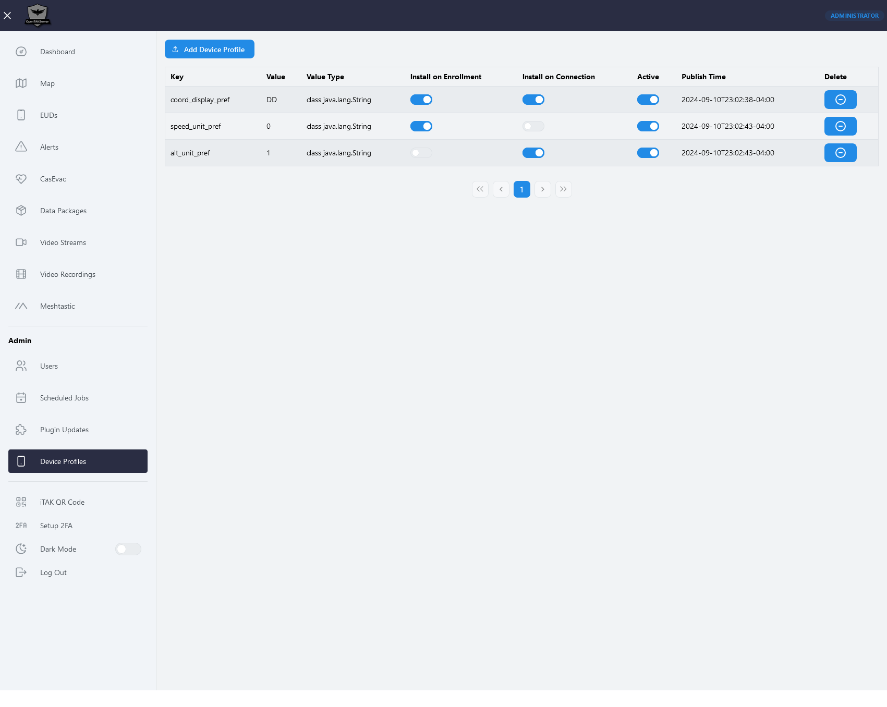

# Device Profiles

***

Device profiles allow administrators to automatically push settings out to EUDs. This can help keep settings in all EUDs
in sync. Future versions of OpenTAKServer will support assigning different settings to specific users or groups of users.

## Usage

***

While logged into OpenTAKServer as an administrator, click on `Device Profiles` in the navbar. There will be a list
of settings that the administrator has already enabled as well as an `Add Device Profile` button.

In the settings list there are three switches for `Install on Enrollment`, `Install on Connection`, and `Active`.

- `Install on Enrollment` - Installs the setting on an EUD after a successful [certificate enrollment](certificate_enrollment.md).
- `Install on Connection` - Installs the setting the next time the EUD connects to the server.
- `Active` - Enables or disables the setting from being installed on EUDs, even if `Install on Enrollment` or `Install on Connection` are enabled.

One or both of `Install on Enrollment` and `Install on Connection` may be enabled for each setting.

## Settings keys and Values

***

Please refer to [MyTeckNet's Spreadsheet](https://mytecknet.com/creating-tak-data-packages-for-enrollment/#atak-preference-key)
for the most complete list of possible settings and their values. Also make sure to set the `Value Type` field is set to the
value of the setting's Type field in the MyTeckNeck spreadsheet.

## Screenshot

***

