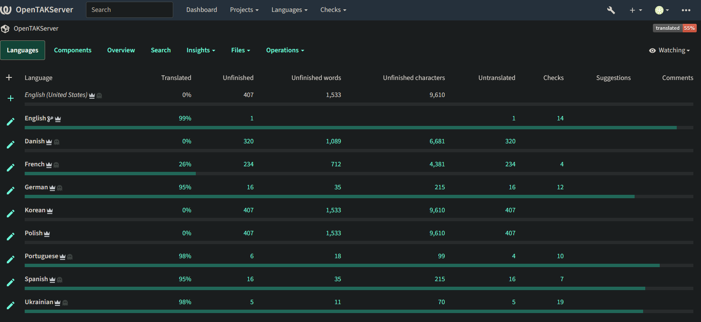
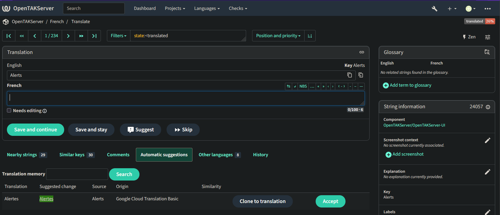

Internationalization
====================

As of version 1.7.0, OpenTAKServer supports internationalization. If you would like to contribute by translating OTS into your language
you can log into the `OTS Weblate Server <https://weblate.opentakserver.io>`__ using GitHub OAuth. With GitHub OAuth you will be
tagged as a contributor once the translation gets merged into the main branch.

View Translation Status
-----------------------

To view the status of supported languages, browse to `https://weblate.opentakserver.io <https://weblate.opentakserver.io>`__
and click on OpenTAKServer. All supported languages, their percentage of completion, and the translations themselves can be viewed without logging in.

Adding New Languages
--------------------

If you would like a language added to OTS that isn't currently listed in Weblate, you can request it by opening a GitHub
issue or in the discord server.

Contributing
------------

After logging in via GitHub OAuth you will be redirected to the Dashboard page. From there, click on the OpenTAKServer project,
and then the language you'd like to translate. Then choose the Untranslated Strings option and you will be taken to the first
untranslated string. On this page you can type the translation in the empty field below the English text and click the
``Save and Continue`` button to go to the next string. See the screenshot at the bottom of this page for an example.

Google Translate API
--------------------

The Weblate server is configured with Google Translate API key. To use it, click on the ``Automatic Suggestions`` button
on the translation screen. See the screenshot below for an example.

