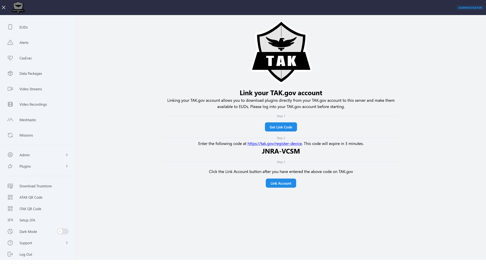
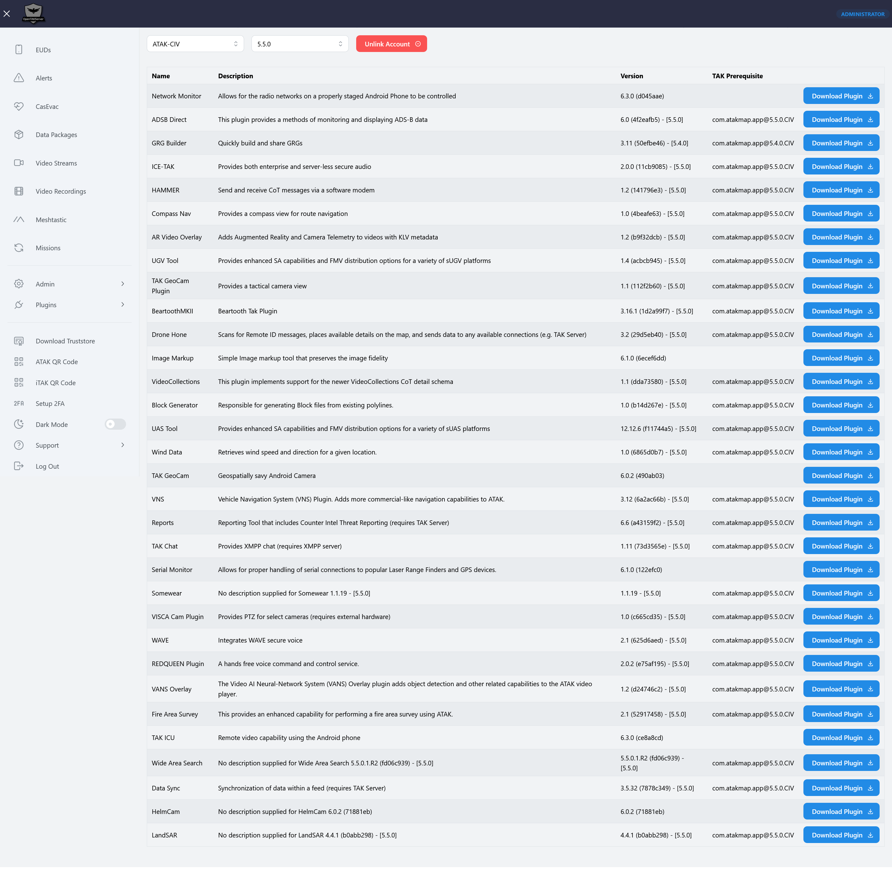

Link TAK.gov Account
====================

OpenTAKServer supports linking a TAK.gov account as of 1.7.0. This is the same as ATAK's ``Link EUD`` feature
and allows server administrators to query TAK.gov for ATAK plugins and download them. The plugins are then available
for EUDs to download and install.

Linking an Account
------------------

Before starting, log into your TAK.gov account. Once logged in, follow these steps to link your account.

1. Click on the ``Get Link Code`` button
2. Enter the code at `<https://tak.gov/register-device>`__. Note that this code will expire three minutes after it's generated.
3. Click the ``Link Account`` button

Plugin List
-----------

After the account is successfully linked, a list of available plugins will be displayed. Clicking the ``Download Plugin``
button will download the plugin to the server and make it available to EUDs to install. The ATAK version and flavor (i.e.
ATAK-CIV, ATAK-GOV, and ATAK-MIL) can be selected. Note that you will only see the plugins that your account is allowed to see.
If your account is only allowed to see ATAK-CIV plugins, selecting ATAK-MIL will not show ATAK-MIL plugins.

Screenshots
-----------

