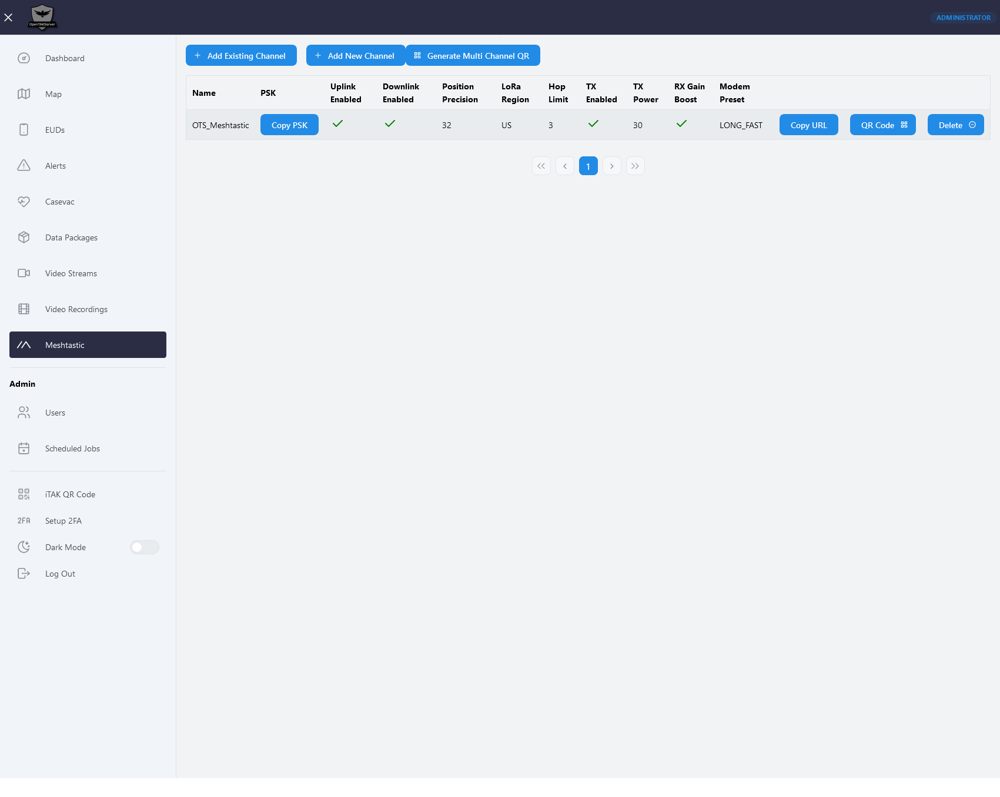
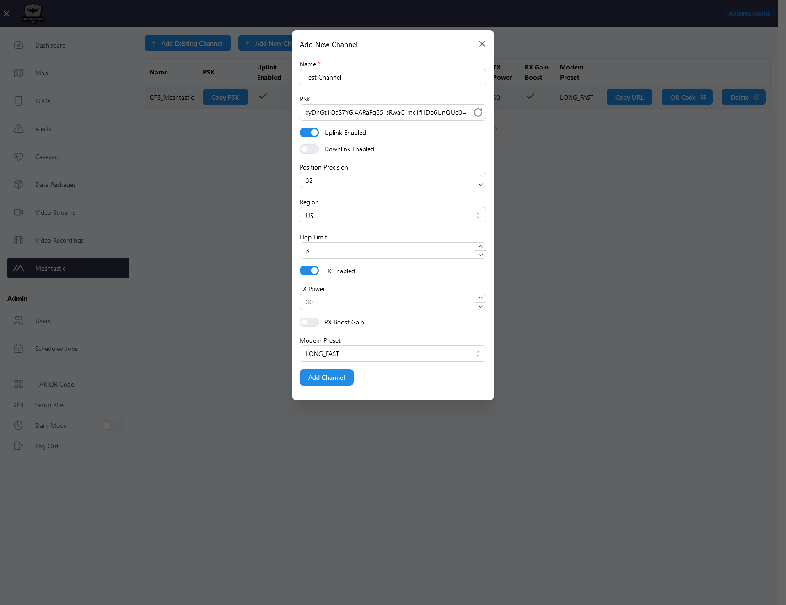

# Meshtastic

***

Meshtastic support is available starting with version 1.2.0.

## Features

***

OpenTAKServer supports two-way communication between Meshtastic devices and EUDs connected to OpenTAKServer. This
means that Meshtastic devices will show up on the maps of EUDs connected to OpenTAKServer and EUDs will show up on
on the Meshtastic app's map. The Meshtastic app can also send and receive messages to All Chat Rooms as well as send
and receive DMs from EUDs.

Additionally, if a Meshtastic device is attached to a phone running ATAK and the ATAK Meshtastic plugin, GeoChat and PLI messages
can be exchanged between EUDs connected to OpenTAKServer and the EUD in the Meshtastic network.

## Notes

***

In order not to overload the Meshtastic network with too many messages, only PLI and GeoChat CoT messages will be
published to Meshtastic devices. Data packages and other CoT's such as markers, routes, geofences, etc, will not be
sent to the mesh network, even if a Meshtastic device is running ATAK with the ATAK Meshtastic plugin.

## Requirements

***

You will need at least two Meshtastic devices. One will be connected to a Wi-Fi network and act as a gateway while the
others will be standard mesh nodes.

## Configuration

***

There are three configuration settings in `config.yml` for Meshtastic support:

- `OTS_ENABLE_MESHTASTIC`: Default: `False`
    - Change to `True` to enable this feature
- `OTS_MESHTASTIC_TOPIC`: Default `opentakserver`
    - This is the MQTT topic that OpenTAKServer will use when publishing messages bound for the Meshtastic network
- `OTS_MESHTASTIC_PUBLISH_INTERVAL`: Default `30` (seconds)
    - In order not to overload the Meshtastic network with too many messages, PLI CoT's from EUDs connected to OpenTAKServer
      will only be sent at this interval. This setting has no effect on GeoChat messages

## Topology

***

A diagram will go here

## Gateway Node Setup

***

The gateway node is responsible for exchanging messages between OpenTAKServer and the Meshtastic network. You can
have multiple gateway nodes connected to one OpenTAKServer and exchange messages on multiple Meshtastic channels.
The gateway node should be set to either the `CLIENT` or `ROUTER_CLIENT` role.

### Network Connection

***

The gateway node needs to be connected to a network that can reach your OpenTAKServer. This can be on the same LAN as
OpenTAKServer, or it can be at a remote site that can reach your OpenTAKServer via VPN or the internet. Refer to
Meshtastic's documentation on how to [enable network connectivity](https://meshtastic.org/docs/configuration/radio/network/).

### MQTT

***

Once the gateway node is connected to a network you must [enable MQTT](https://meshtastic.org/docs/configuration/module/mqtt/).
The settings should be as follows:

- MQTT: Enabled
- MQTT Server Address: Your server's address
- MQTT Username: A valid username from an account on your server
- MQTT Password: The password for the above username
- Encryption: Disabled (Messages will be encrypted in transit with TLS)
- TLS: Enabled
- Root Topic: Value of the `OTS_MESHTASTIC_TOPIC` setting which defaults to `opentakserver`
- Proxy to client: Disabled
- Map Reporting: Enabled (Optional)
- Map Report Publish Interval: 86400 (Optional)
- Position Precision: High (Optional)

### Channels

***

OpenTAKServer's Web UI now includes a Meshtastic page which can generate channel configurations. In order to send
messages from OpenTAKServer to the Meshtastic network, you must add a channel configuration on this UI page with the
`downlink` setting enabled. When Meshtastic support is enabled, OpenTAKServer will publish messages to each channel
that has the `downlink` option enabled.

Once you add a channel configuration in the UI, click the QR code button and use the Meshtastic app to add the channel
to your gateway node.

