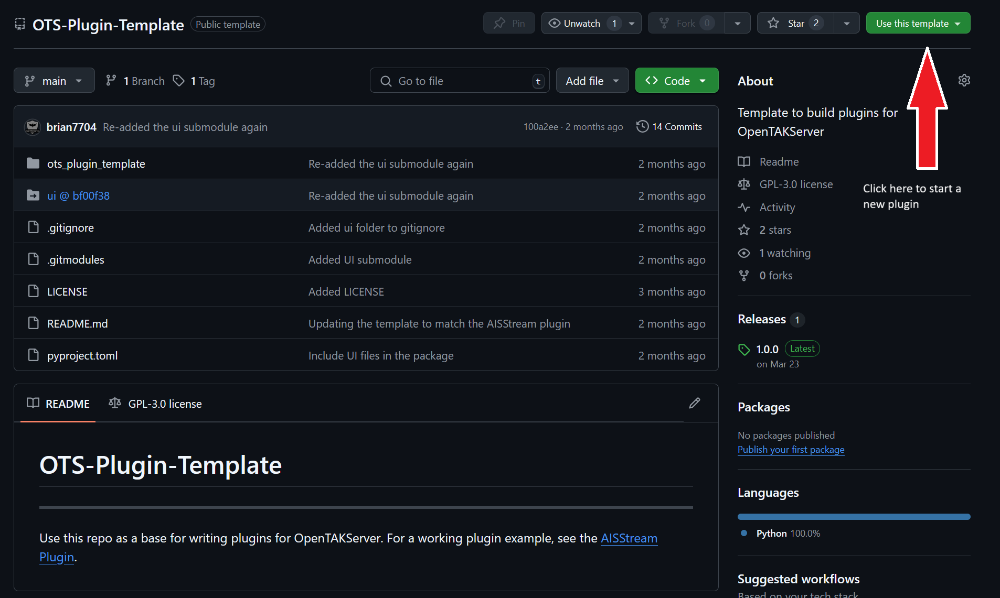

==============
Server Plugins
==============

As of version 1.5.0, OpenTAKServer includes a plugin system.

Like OpenTAKServer, plugins are made using Python's `Flask <https://flask.palletsprojects.com/en/stable/>`_ framework.
Specifically, plugins are `Flask Blueprints <https://flask.palletsprojects.com/en/stable/tutorial/views/>`_.

Plugins classes must be a subclass of ``opentakserver.plugins.Plugin.Plugin``

Plugins can be created by making a new repository from `OTS-Plugin-Template <https://github.com/brian7704/OTS-Plugin-Template>`_.
See the screenshot below.

----
Web UI
----

Plugins can optionally include a web UI that will be displayed in an iframe in OpenTAKServer's UI. Plugin UIs
are written in the `Mantine <https://mantine.dev/>`_ react framework. To start a new plugin UI, create a new repo from
the `OTS-UI-Plugin-Template <https://github.com/brian7704/OTS-UI-Plugin-Template>`_. The UI repo should be separate from the
plugin's repo. See the `SkyFi Plugin's UI <https://github.com/brian7704/OTS-SkyFi-Plugin-UI>`_ for an example.

When building your plugin's UI, it's assumed that your code is in ``~/Webstorm Projects/Your-OTS-Plugin-UI`` and your plugin is at
``~/PyCharm Projects/Your-OTS-Plugin``. The ``npm build`` command will automatically put the built UI files in ``~/PyCharm Projects/Your-OTS-Plugin/ui``.
If your code is in another directory, edit the ``outDir`` option in your UI's `vite.config.mjs <https://github.com/brian7704/OTS-UI-Plugin-Template/blob/bf00f38321d24572a85210d40809ec8cc2454893/vite.config.mjs#L13>`_
file

----
Licensing
----

Plugins that are publicly distributed must use the GPLv3 or another `compatible <https://gplv3.fsf.org/wiki/index.php/Compatible_licenses>`_ license.

----
Public Repo
----

While plugins can be distributed or kept private as the author chooses (including on PyPI), there is a public plugin repo available. Plugins on this
repo will be accepted after a code review to make sure it meets the plugin requirements, works as intended, and doesn't contain any
malicious code. Once accepted, OpenTAKServer users will be able to install plugins from this repo from within the web UI. The repo
can be browsed at https://repo.opentakserver.io.

----
Development
----

While any IDE can be used for development, this guide will focus on `PyCharm <https://www.jetbrains.com/pycharm/download>`_
for the plugin and `Webstorm <https://www.jetbrains.com/webstorm/>`_ for the UI. Both PyCharm and Webstorm have free versions which can be used.

++++++
Poetry
++++++

`Poetry <https://python-poetry.org/>`_ is used to build, package, and version plugins, as well as manage dependencies.

++++++++++
Versioning
++++++++++

`Poetry Dynamic Versioning <https://github.com/mtkennerly/poetry-dynamic-versioning>`_ is used to version plugins based on git tags.
When a new version of your plugin is ready to be released, a new git tag should be created with the plugin version using
`Semantic Versioning <https://semver.org/>`_. For example, the first version tag could be ``1.0.0``. Then when building the plugin
for distribution using the ``poetry build`` command, the sdist and wheel files will be automatically tagged with this version number.

++++++++++++++++++++++++++++
Start Developing Your Plugin
++++++++++++++++++++++++++++

The things that need to be changed are marked with ``TODO`` comments in OTS-Plugin-Template and OTS-UI-Plugin-Template.

#. pyproject.toml
    #. Set the name, description, author information, and URLs
        *. The name must start with ``OTS-``
    #. Change the ``include`` option under ``[tool.poetry]`` to the name of the folder that contains your plugin's code
    #. Do the same for ``tool.poetry-dynamic-versioning.files``
#. app.py
    #. Change the class name
    #. Change the name of the blueprint from ``PluginTemplate`` to your plugin's name
    #. Add API routes as necessary. Remember to protect your routes using the ``@auth_required`` or ``@roles_accepted`` decorators
    #. Edit the ``activate()`` method if your plugin needs to run in the background. For example, the AISStream plugin uses the ``activate()`` method to connect to AISStream's servers to pull data.
#. default_config.py
    #. Rename ``OTS_PLUGIN_TEMPLATE_ENABLED`` to your plugin's name
    #. Add config options as necessary
    #. Edit the validate() method to validate user input