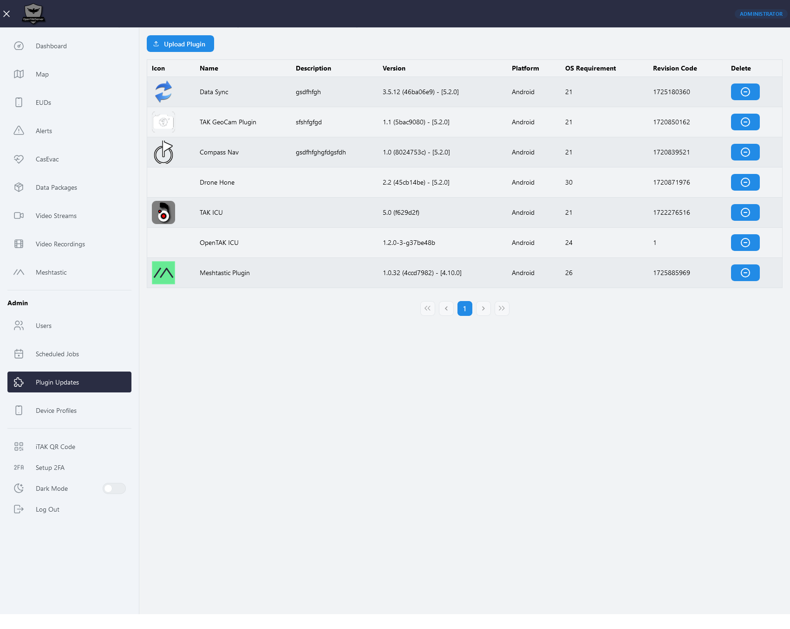

# Plugin Update Server

OpenTAKServer supports ATAK's plugin update system. An administrator of an OTS server can upload plugin APKs which will
be automatically pushed out to EUDs when ATAK is opened.

## Obtaining Plugins

OpenTAKServer does not come with any plugins. Official plugins are available at [TAK.gov](https://tak.gov) and some
open source plugins are available on GitHub. You must obtain them and upload them to your OpenTAKServer manually.

## Uploading Plugins

While logged in as an administrator, browse to the Plugin Updates page in the navbar. Here you will see the list of
plugins that are currently available for EUDs to download. Click the Upload Plugin button to upload a plugin APK. The
only required field is the Plugin File field. OpenTAKServer will automatically the extract required metadata 
(i.e. revision code, plugin name, minimum required Android and ATAK versions, etc.), as well as automatically generate
the required `product.infz` file.

OpenTAKServer will also attempt to extract the plugin's icon from the APK. However, it will only succeed if the plugin's icon
is in PNG format, not in Android vector xml format. Because of this, you can optionally specify a separate icon file
in the upload form. The icon should be a PNG file.

## Plugin Versions

Starting in version 1.6.0, OpenTAKServer supports uploading plugins for different versions of ATAK. This is to support
a feature introduced in ATAK 5.5 where ATAK will request a list of plugins for its version. ATAK 5.4 and prior will still
query for a list of all plugins.

## Screenshot

## ATAK Settings

When connecting an EUD to OpenTAKServer the first time, it is recommended to use [Certificate Enrollment](certificate_enrollment.md)
or a data package generated in OpenTAKServer's UI. These connection methods will automatically enable ATAK's plugin
update feature.

For manual setup, follow these steps:

1. Click ATAK's hamburger icon (three horizontal lines in the top left corner)
2. Select the Plugin tool
3. Select the gear icon at the bottom of the screen
4. Enable `Plugin Loading`, `Auto Sync`, and `Update Server`
5. For `Update Server URL` enter `https://<YOUR_SERVER_ADDRESS>:8443/api/packages`
6. For `Update Server SSL/TLS Truststore Location`, select your OpenTAKServer's `truststore-root.p12` on your device
    1. You can get a copy of your server's `truststore-root.p12` file by browsing to `https://<YOUR_SERVER_ADDRESS>/api/truststore`
7. For `Update Server SSL/TLS Truststore Password`, enter your truststore's password. The default is `atakatak`