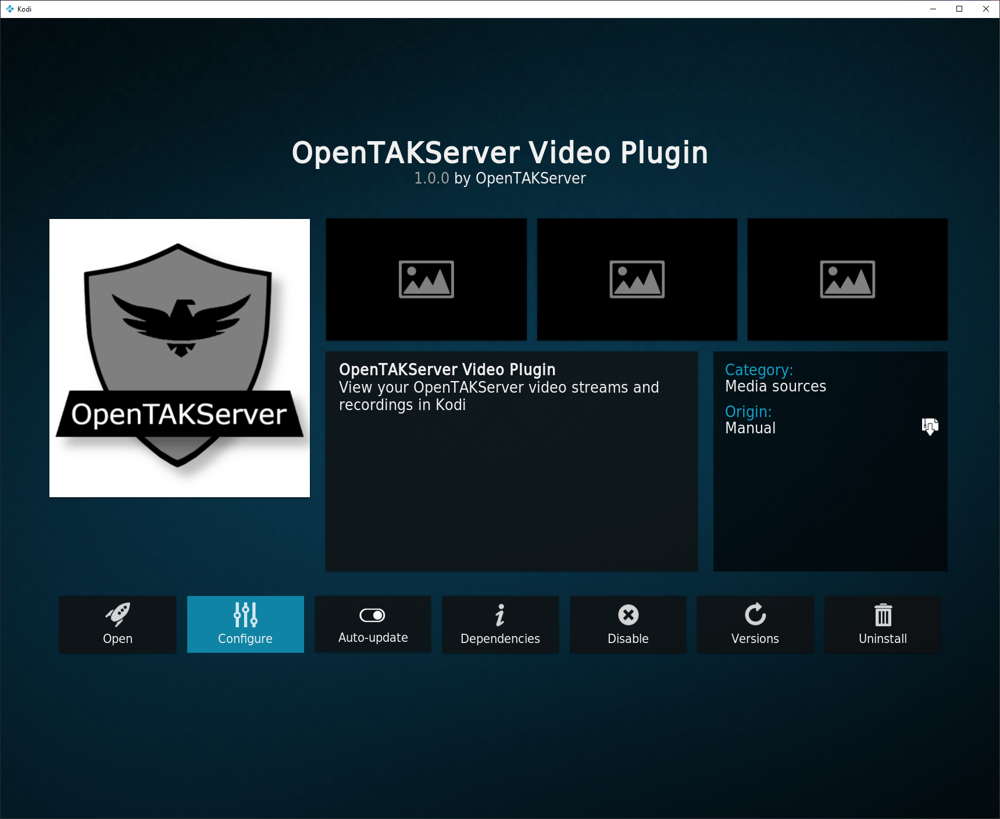
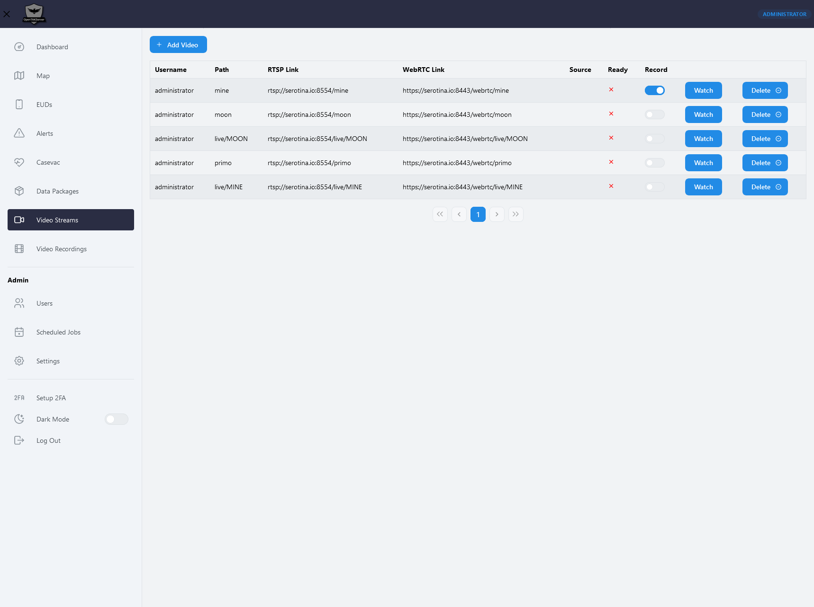

# Video Streaming

***

OpenTAKServer uses [MediaMTX](https://github.com/bluenviron/mediamtx) for video streaming and recording. It accepts
streams from apps such as [OpenTAK ICU](https://github.com/brian7704/OpenTAK_ICU) and TAK ICU, as well as devices like drones and IP Cameras.

## Streaming From Your Browser

***

OpenTAKServer supports streaming from any device that has a browser and a camera. On the Video Streams page of
OpenTAKServer's web UI there is a button labeled `Start Streaming`. Clicking that button will prompt the browser to ask
for permission to use your device's camera and microphone to stream audio and video to MediaMTX. This is helpful in situations
where someone with an Android or iOS device would like to stream to other users on the server but they have no app to do so.
Laptop and desktop computers can also use this button to stream from their cameras.

Note that streaming in this way only streams audio and video. Users can view the stream on their EUDs, but no location
information is included with the stream, meaning there will be no icon on OpenTAKServer's or any EUD's maps for the location
of the stream.

## Streaming Protocols

***

You can stream to MediaMTX using a variety of protocols:

- RTSP(S)
- RTMP(S)
- SRT
- HLS
- WebRTC
- UDP Multicast

## Watching Video Streams

***

### In Browser

***

In OpenTAKServer, click on `Video Streams`. In the list of streams, click the `Watch` button on the stream you want to view.
A video player will show up below the list of streams. There is a known issue where the player sometimes doesn't show up.
If that happens, refresh the page and try again.

Alternatively, you can copy the WebRTC link of the video and paste it in a new tab.

### In ATAK

***

When ATAK is connected to OpenTAKServer, open the Video tool, then tap the download button. ATAK will query the server
for a list of video streams. Choose which stream to view and tap the `Ok` button. Next, edit the video settings and add your
OpenTAKServer username and password. You can now view the video stream.

### In Kodi

***

There is an add-on for [Kodi](https://kodi.tv/) that allows you to watch streams and recordings from your server. The add-on
works on all platforms that Kodi works on (Windows, macOS, Linux, Android, iOS, etc). To in stall the add-on, browse to
Add-ons -> Download -> Video add-ons -> OpenTAKServer Video Plugin and select the install button.

The first time the add-on is started, it will take you to the settings screen where you will need to enter your server's
address, username, and password.

### In VLC

***

Copy the RTSP link from OpenTAKServer. In VLC, click Media -> Open Network Stream. Paste the RTSP link and click the Play
button. You will be prompted for your OpenTAKServer username and password. Enter them and click Ok.

## Recording Streams

***

To record a stream, simply click on the stream's record switch. You can do this during a stream or while not streaming.
Recording automatically starts when a stream goes live and stops one the stream stops. Recorded videos will be in
`~/ots/mediamtx/recordings/<path_name>` by default. You can watch and download recording by clicking `Video Recordings`
in the navigation bar.

## Screenshot

***

